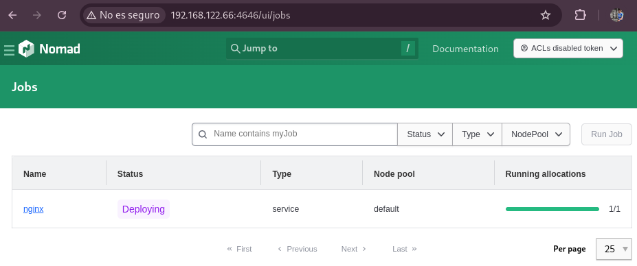
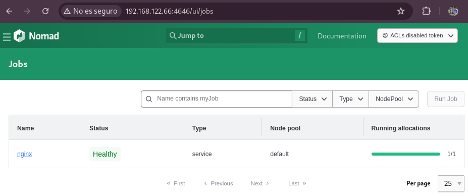
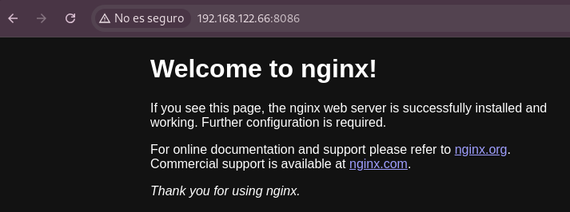

# Despliegue de Nginx con Nomad

En este tutorial se explica como desplegar Nginx con Nomad Hashicorp en un contenedor Docker, usando Debian 12 como Host.

## Requisitos

- Nomad.- [*Instalación Nomad*](https://developer.hashicorp.com/nomad/docs/install)

- Docker.- [*Instalación Docker*](https://docs.docker.com/engine/install/debian/)

## Clonar repositorio

Lo primero que realizamos será la clonación del repositorio donde encontraremos los ficheros necesarios:

~~~
git clone https://github.com/alealbaladejo/Proyecto-Final-Nomad.git
~~~

~~~
cd Proyecto-Final-Nomad/despliegue-nginx
~~~

## Job

~~~
cat nginx.hcl

job "nginx" {
  datacenters = ["dc1"]
  type = "service"

  group "nginx" {
    count = 1

    network {
      port "http" {
        static = 8086
        to = 80
      }
    }

    task "nginx" {
      driver = "docker"

      config {
        image = "nginx:latest"
        ports = ["http"]
      }

      service {
        provider = "nomad"
        name = "nginx"
        port = "http"
      }
    }
  }
}

~~~

**job “nginx”:** Define un job nuevo que se va a llamar nginx.

**datacenters = [“dc1”]:** Indica que el job se desplegará en el datacenters dc1 que por defecto es el que viene configurado.

**type = “service”:** Dice que este job es un servicio, por lo que debe mantenerse corriendo.

**group “nginx”:** Define un grupo de tareas con el nombre nginx.

**count = 1:** Se lanzará una única instancia del grupo.

**network:** Define la configuración de red para el grupo

**port “http”:** Declara un puerto que se llama http

**static = 8086:** Reserva el puerto 8086 del host 

**to = 80:** Se redirige al puerto 80 del contenedor.

**task “nginx”:** Define una tarea llamada nginx.

**driver = “docker”:** Usará docker como driver para ejecutar la tarea.

**image:** Será la imagen docker que usará

**ports:** Expone el puerto declarado en el bloque network.
      
**service:** Permite que Consul o Nomad conozcan este servicio.

**provider = “nomad”:** Indica que se usa el proveedor de servicios interno de Nomad

**name = “nginx”:** Nombre del servicio.

**port = “http”:** Puerto definido como http

---
Una vez que ya tenemos claro que es cada apartado del job anterior, pasamos a ejecutar los comandos necesarios para familiarizarnos con Nomad:

Lo primero que hacemos es comprobar que tenemos el servicio de Nomad activo, en caso de no tenerlo lo levantamos con:
~~~
sudo systemctl start nomad
~~~
~~~
sudo systemctl status nomad
● nomad.service - Nomad
     Loaded: loaded (/lib/systemd/system/nomad.service; disabled; preset: enabled)
     Active: active (running) since Mon 2025-05-19 18:15:05 CEST; 1s ago
       Docs: https://nomadproject.io/docs/
   Main PID: 33076 (nomad)
      Tasks: 37
     Memory: 177.7M
        CPU: 1.440s
     CGroup: /system.slice/nomad.service
             ├─30329 /usr/bin/nomad logmon
             └─33076 /usr/bin/nomad agent -config /etc/nomad.d

~~~

---
Pasamos a desplegar el job con:

~~~
nomad job run nginx.hcl
~~~

Y mientras se despliega podemos ver como se ve en la interfaz gráfica (http://<direccion-ip\>:4646):

Una vez que termina de desplegarse:

Vemos que el estado ahora ha pasado de **Deploying** a **Healthy**

Podemos ver información desde la propia terminal como por ejemplo conocer detalles sobre una instancia (allocation):

~~~
nomad job status nginx

ID            = nginx
Name          = nginx
Submit Date   = 2025-05-19T16:01:02+02:00
Type          = service
Priority      = 50
Datacenters   = dc1
Namespace     = default
Node Pool     = default
Status        = running
Periodic      = false
Parameterized = false

Summary
Task Group  Queued  Starting  Running  Failed  Complete  Lost  Unknown
nginx       0       0         1        0       0         0     0

Latest Deployment
ID          = ed4d7023
Status      = successful
Description = Deployment completed successfully

Deployed
Task Group  Desired  Placed  Healthy  Unhealthy  Progress Deadline
nginx       1        1       1        0          2025-05-19T16:11:15+02:00

Allocations
ID        Node ID   Task Group  Version  Desired  Status   Created   Modified
7ade50b5  73516670  nginx       0        run      running  6m3s ago  5m50s ago
~~~

Ahora ya conocemos el id (7ade50b5) y podemos especificar un poco más la información:

~~~
nomad alloc status 7ade50b5

…
Created             = 9m40s ago
Modified            = 9m27s ago
Deployment ID       = ed4d7023
Deployment Health   = healthy

Allocation Addresses:
Label  Dynamic  Address
*http  yes      192.168.122.66:8086 -> 80

Task "nginx" is "running"
Task Resources:
CPU        Memory           Disk     Addresses
0/100 MHz  4.7 MiB/300 MiB  300 MiB  

Recent Events:
Time                       Type        Description
2025-05-19T16:01:05+02:00  Started     Task started by client
2025-05-19T16:01:03+02:00  Driver      Downloading image
2025-05-19T16:01:02+02:00  Task Setup  Building Task Directory
2025-05-19T16:01:02+02:00  Received    Task received by client

~~~

Aquí podemos ver información como el tiempo desde que se creó o modificó, el estado, la dirección en la que se está ejecutando…

Para ver los logs podemos hacerlo con el comando:

~~~
nomad alloc logs 7ade50b5

/docker-entrypoint.sh: /docker-entrypoint.d/ is not empty, will attempt to perform configuration
/docker-entrypoint.sh: Looking for shell scripts in /docker-entrypoint.d/
/docker-entrypoint.sh: Launching /docker-entrypoint.d/10-listen-on-ipv6-by-default.sh
10-listen-on-ipv6-by-default.sh: info: Getting the checksum of /etc/nginx/conf.d/default.conf
10-listen-on-ipv6-by-default.sh: info: Enabled listen on IPv6 in /etc/nginx/conf.d/default.conf
/docker-entrypoint.sh: Sourcing /docker-entrypoint.d/15-local-resolvers.envsh
/docker-entrypoint.sh: Launching /docker-entrypoint.d/20-envsubst-on-templates.sh
/docker-entrypoint.sh: Launching /docker-entrypoint.d/30-tune-worker-processes.sh
/docker-entrypoint.sh: Configuration complete; ready for start up
~~~

Y si queremos entrar en la máquina podemos hacerlo con:

~~~
nomad alloc exec -task nginx -t 7ade50b5 /bin/bash
root@077304aba3d6:/# 
~~~

Ahora pasamos a comprobar que nos está desplegando Nginx en el puerto indicado
Lo podemos comprobar con curl:

~~~
curl <direccion-ip>:8086

<!DOCTYPE html>
<html>
<head>
<title>Welcome to nginx!</title>

</head>
<body>
<h1>Welcome to nginx!</h1>

If you see this page, the nginx web server is successfully installed and
working. Further configuration is required.

For online documentation and support please refer to
<a href="http://nginx.org/">nginx.org</a>. 
Commercial support is available at
<a href="http://nginx.com/">nginx.com</a>.

<em>Thank you for using nginx.</em>

</body>
</html>
~~~

También podemos comprobarlo desde el navegador web, accediendo a la misma dirección que en el *curl*:

Por último podemos comprobar que se ha creado un contenedor docker:

~~~
docker ps
CONTAINER ID   IMAGE          COMMAND                  CREATED          STATUS          PORTS                                                    NAMES
2f39465254cc   nginx:latest   "/docker-entrypoint.…"   41 seconds ago   Up 40 seconds   192.168.1.136:8086->80/tcp, 192.168.1.136:8086->80/udp   nginx-ed07c964-174f-cb75-814f-13246f96dadc

~~~

## Fin

Con esto has realizado los pasos necesarios para desplegar un servidor Nginx, en Docker con Nomad Hashicorp.
