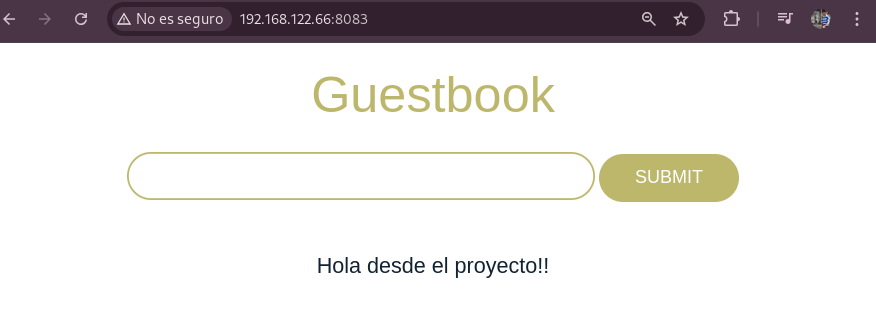
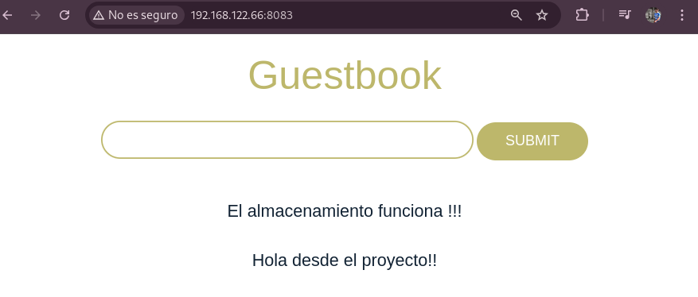

# Despliegue de Guestbook conectada a una BD Redis con Nomad

En este tutorial se explica como desplegar la aplicación guestbook que se conecta a una base de datos Redis, con Nomad Hashicorp en un contenedor Docker, usando Debian 12 como Host.

## Requisitos

- Nomad.- [*Instalación Nomad*](https://developer.hashicorp.com/nomad/docs/install)

- Docker.- [*Instalación Docker*](https://docs.docker.com/engine/install/debian/)

## Clonar repositorio

Lo primero que realizamos será la clonación del repositorio donde encontraremos los ficheros necesarios:

~~~
git clone https://github.com/alealbaladejo/Proyecto-Final-Nomad.git
~~~

~~~
cd Proyecto-Final-Nomad/guestbook-redis-vol-persistente
~~~

## Configuración del volumen persistente

A continuación vamos a desplegar la aplicación Guestbook conectada a una base de datos Redis, desde el mismo fichero.

Lo primero que haremos será añadir un volumen para que redis guarde sus datos ahí y hacerlo persistente.
Creamos el directorio donde se guardará la información
~~~
sudo mkdir  -p /opt/nomad/redis
~~~

Ahora modificamos de nuevo el fichero de configuración para añadir este directorio como volumen:
~~~
cat /etc/nomad.d/nomad.hcl
...
client {
  enabled = true
  servers = ["127.0.0.1"]
…
  host_volume "redis_volume" {
    path = "/opt/nomad/redis"
    read_only = false
  }
}
~~~

Reiniciamos el servicio de Nomad:
~~~
sudo systemctl restart nomad.service
~~~

## Job

Ahora vemos el fichero que contiene las dos tareas:

~~~
cat guestbook.hcl

job "guestbook" {
  datacenters = ["dc1"]

  group "guestbook-group" {
    network {
      port "http" {
        to = 5000
        static = 8083
      }
      port "redis" {
	to = 6379
	static = 6379
      }
    }
    volume "redis_data" {
      type      = "host"
      read_only = false
      source    = "redis_volume"
    }

    task "redis" {
      driver = "docker"

      config {
        image = "redis"
        command = "redis-server"
        args = ["--appendonly", "yes"]
        ports = ["redis"]
      }

      volume_mount {
        volume      = "redis_data"
        destination = "/data"
        read_only   = false
      }

      resources {
        cpu    = 200
        memory = 256
      }
    }

    task "app" {
      driver = "docker"

      config {
        image = "iesgn/guestbook"
        ports = ["http"]
      }
      env {
        REDIS_SERVER = "${NOMAD_IP_redis}"
      }

      resources {
        cpu    = 200
        memory = 256
      }

      service {
        provider = "nomad"
        name = "guestbook"
        port = "http"
      }
    }

  }
}
~~~

## Detalles del job
- La app Guestbook escucha en el puerto 5000, que se mapea al 8083 del host.

- Redis corre en el puerto estándar 6379.

- Usamos NOMAD_IP_redis para que la app encuentre la IP del contenedor Redis automáticamente, sin hardcodearla.

- Redis almacena los datos en /data, que está montado desde /opt/nomad/redis del host.

## Despliegue
Ahora desplegamos el job:
~~~
nomad job run guestbook.hcl 
~~~

Y podemos ver desde el navegador en el puerto especificado la aplicación corriendo.

## Comprobación de persistencia
Ahora borramos por completo el job para comprobar el almacenamiento persistente una vez que se despliegue un nuevo contenedor.

~~~
nomad job stop -purge guestbook

==> 2025-05-22T13:33:33+02:00: Monitoring evaluation "abc51f5c"
    2025-05-22T13:33:33+02:00: Evaluation triggered by job "guestbook"
    2025-05-22T13:33:33+02:00: Evaluation status changed: "pending" -> "complete"
==> 2025-05-22T13:33:33+02:00: Evaluation "abc51f5c" finished with status "complete"
~~~

Y volvemos a desplegar la aplicación:
~~~
nomad job run guestbook.hcl 
~~~

Veremos cómo el mensaje que enviamos antes, sigue estando.

Con esto ya tendríamos desplegado la aplicación conectada a la base de datos y con un volumen persistente.