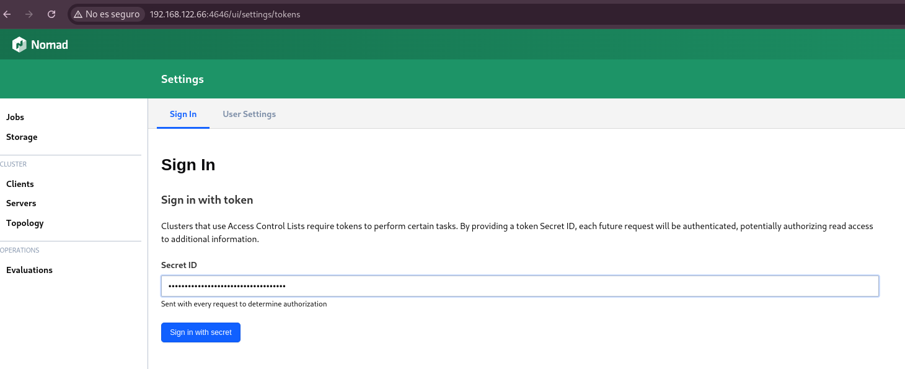
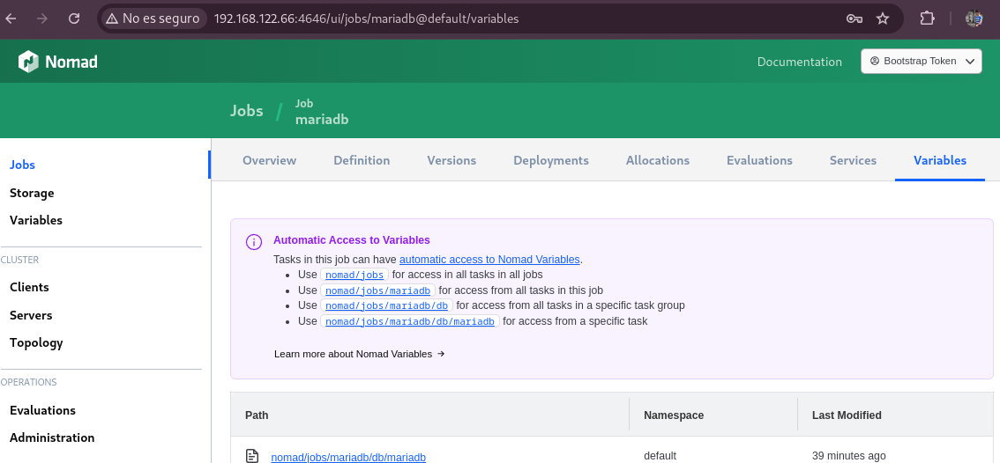
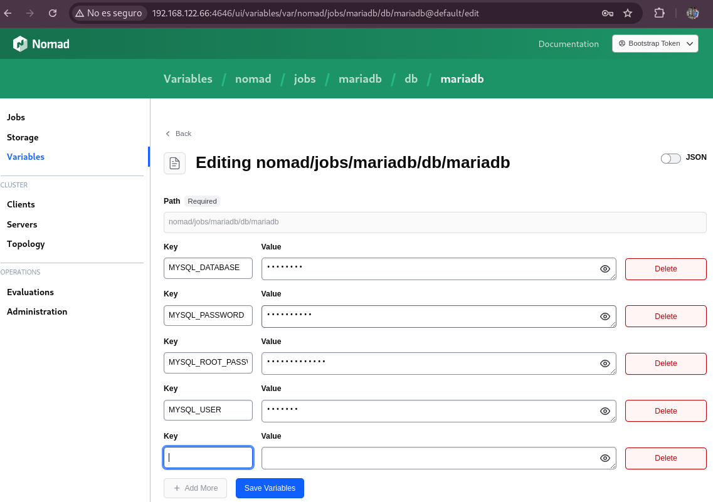

# Despliegue de MariaDB con Nomad

En este tutorial se explica como desplegar una base de datos MariaDB con Nomad Hashicorp en un contenedor Docker, usando Debian 12 como Host.

## Requisitos

- Nomad.- [*Instalación Nomad*](https://developer.hashicorp.com/nomad/docs/install)

- Docker.- [*Instalación Docker*](https://docs.docker.com/engine/install/debian/)

## Clonar repositorio

Lo primero que realizamos será la clonación del repositorio donde encontraremos los ficheros necesarios:

~~~
git clone https://github.com/alealbaladejo/Proyecto-Final-Nomad.git
~~~

~~~
cd Proyecto-Final-Nomad/mariadb-variables
~~~

## Job

A continuación vamos a desplegar una base de datos MariaDB, para entender el funcionamiento de variables en los jobs de Nomad.
Lo primero vamos a comentar las cosas nuevas del job:

~~~
cat mariadb.hcl 
job "mariadb" {
  datacenters = ["dc1"]
  type        = "service"

  group "db" {
    count = 1

    network {
      port "db" {
        to = 3306
	static = 3306
      }
    }

    task "mariadb" {
      driver = "docker"

      config {
        image = "mariadb:latest"
        ports = ["db"]
      }

      template {
        destination = "${NOMAD_SECRETS_DIR}/db.env"
        env         = true
        change_mode = "restart"

        data = <<EOT
MYSQL_ROOT_PASSWORD={{ with nomadVar "nomad/jobs/mariadb/db/mariadb" }}{{ .MYSQL_ROOT_PASSWORD }}{{ end }}
MYSQL_DATABASE={{ with nomadVar "nomad/jobs/mariadb/db/mariadb" }}{{ .MYSQL_DATABASE }}{{ end }}
MYSQL_USER={{ with nomadVar "nomad/jobs/mariadb/db/mariadb" }}{{ .MYSQL_USER }}{{ end }}
MYSQL_PASSWORD={{ with nomadVar "nomad/jobs/mariadb/db/mariadb" }}{{ .MYSQL_PASSWORD }}{{ end }}
EOT
      }
      service {
        provider = "nomad"
        name     = "mariadb"
        port     = "db"
        tags     = ["db", "mariadb"]
      }

      resources {
        cpu    = 500
        memory = 512
      }
    }
  }
}
~~~
La parte nueva que hemos añadido aquí que no hemos visto antes es la opción de **template**, que básicamente define un bloque de plantilla que Nomad procesa antes de iniciar la tarea. Normalmente se usa para inyectar variables de entorno.

En este bloque:

**destination = “${NOMAD_SECRETS_DIR}/db.env”**: Es la ruta dentro del contenedor donde se escribirá el contenido.

**env = true:** Indica que el archivo generado debe ser cargado como variables de entorno dentro del contenedor.

**data = <<EOT … EOT>>:** Aquí se define el contenido de la plantilla.

**{{ with nomadVar "nomad/jobs/mariadb/db/mariadb" }}:** With evalúa si existe esa variable y carga una variable del sistema de variables de Nomad que se encuentra en la ruta especificada.

**{{ .MYSQL_ROOT_PASSWORD }}{{ end }}:** Aquí se accede a una clave específica dentro del mapa cargado por nomadVar, que en este caso es MYSQL_ROOT_PASSWORD. 

**{{end}}** cierra el bloque with.

En definitiva, lo que hace es cargar las variables que previamente se han añadido con el comando:

~~~
nomad var put nomad/jobs/mariadb/db/mariadb \ MYSQL_ROOT_PASSWORD=root_password \
MYSQL_DATABASE=database \
MYSQL_USER=usuario \
MYSQL_PASSWORD=my_password
~~~

Ahora ejecutamos el job:
~~~
nomad job run mariadb.hcl 
~~~

Si entramos en el contenedor podemos ver que se han añadido estas variables:
~~~
nomad alloc exec -task mariadb -t 449a6cbd /bin/bash

root@2d62addf2eb7:/# echo $MYSQL_DATABASE
database
~~~

Para verlas con un comando nomad:
~~~
nomad var get nomad/jobs/mariadb/db/mariadb

Namespace   = default
Path        = nomad/jobs/mariadb/db/mariadb
Create Time = 2025-05-20T16:26:00+02:00
Check Index = 669

Items
MYSQL_DATABASE      = database
MYSQL_PASSWORD      = mypassword
MYSQL_ROOT_PASSWORD = root_password
MYSQL_USER          = usuario
~~~

Podemos ver estas variables con la interfaz gráfica también pero antes tendríamos que configurar varias cosas, ya que por defecto no aparece la opción de ver las variables en la interfaz gráfica.

Lo primero que haremos es añadir una política de acl en la configuración de nomad:

~~~
cat /etc/nomad.d/nomad.hcl
…
acl {
  enabled = true
  token_ttl = "30s"
  policy_ttl = "30s"
  replication_token = ""
}
~~~

Una vez cambiado el fichero de configuración, reiniciamos el servicio.
~~~
sudo systemctl restart nomad.service
~~~

Y ejecutamos:
~~~
nomad acl bootstrap

Accessor ID  = 6214f5e8-...
Secret ID    = e981364f-...
…
~~~

Exportamos el Secret ID:
~~~
export NOMAD_TOKEN="e981364f-..."
~~~

Ahora entramos en la interfaz gráfica y añadimos el secret ID como token:

Podremos ver las variables, que como anteriormente la creamos en “nomad/jobs/mariadb/db/mariadb”, pues accedemos a esta URL, donde nos encontraremos estas variables.

Aquí podemos modificar esas variables y crear otras nuevas.

Ahora podemos acceder desde fuera del contenedor a la base de datos desplegada en Nomad:

~~~
mysql -u usuario -h 192.168.122.66 -D database -p
Enter password: 
Welcome to the MariaDB monitor.  Commands end with ; or \g.
Your MariaDB connection id is 10
Server version: 11.7.2-MariaDB-ubu2404 mariadb.org binary distribution

Copyright (c) 2000, 2018, Oracle, MariaDB Corporation Ab and others.

Type 'help;' or '\h' for help. Type '\c' to clear the current input statement.

MariaDB [database]> 
~~~

Con esto ya tendríamos una base de datos desplegada en Nomad Hashicorp, incluyendo las variables necesarias.